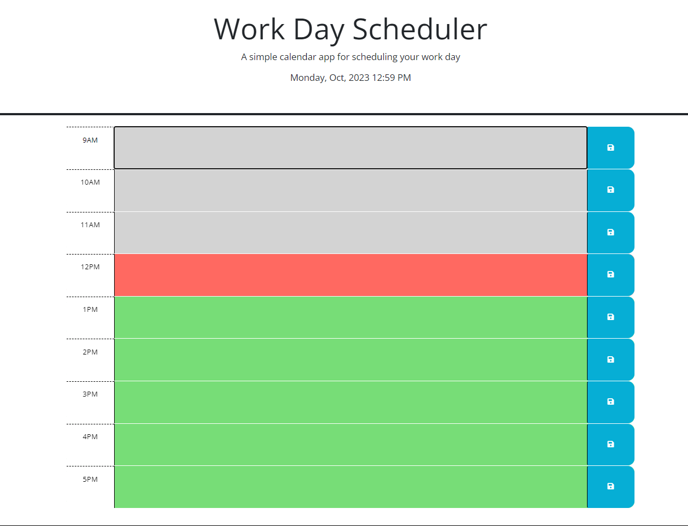
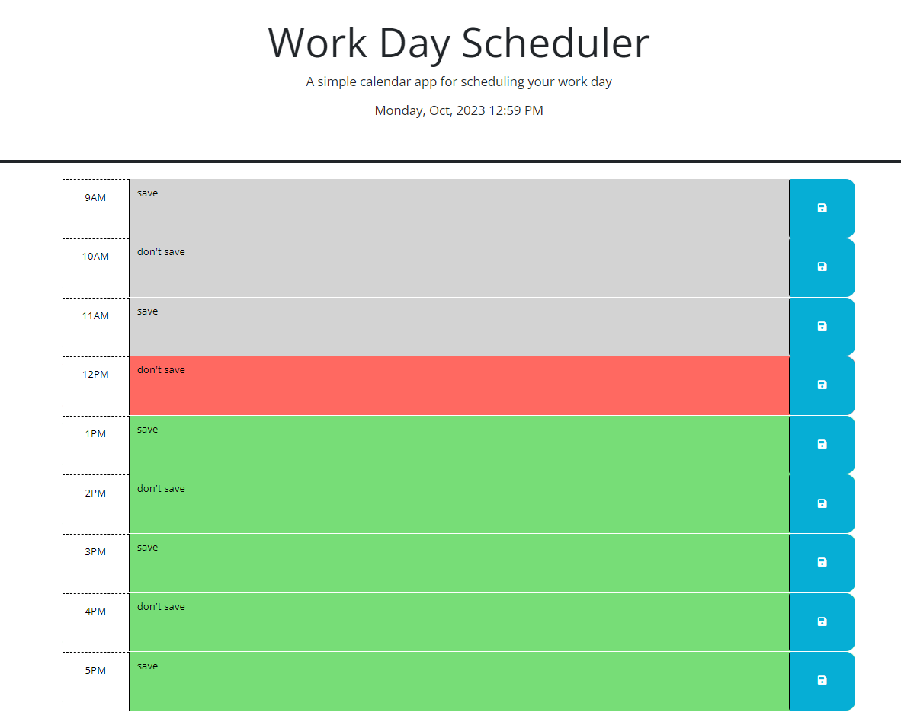
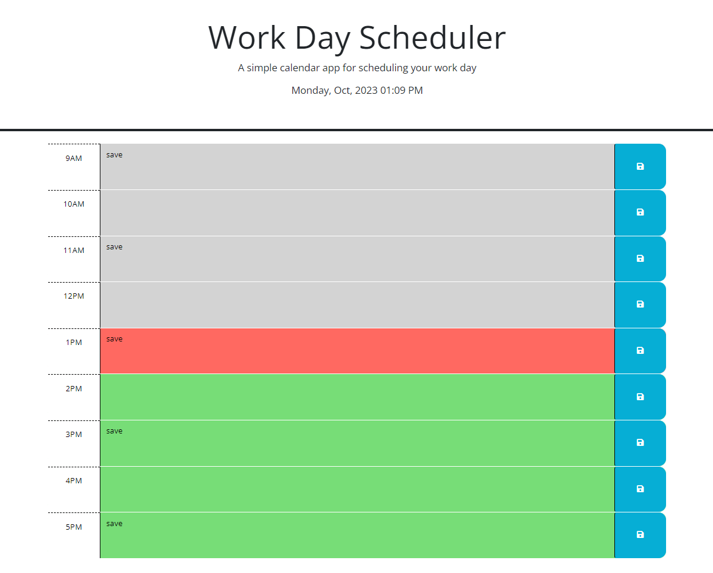

# 05-Calendar-App

This is a calendar application that allows  a user to save events for each hour of the day by modifying starter code. This app will run in the browser and feature dynamically updated HTML and CSS powered by jQuery.

Test it out here: [Deployed Link](https://abi-gail17.github.io/05-Calendar-App/)

## Table of Contents
[Screenshots](#screenshots-of-application)
[Credit](#credit)
[Installation](#installation)
[License](#license)

## Screenshots of Application

## Credit

Base code provided by UofT Coding Bootcamp

## Installation

N/A

## License

License in repo